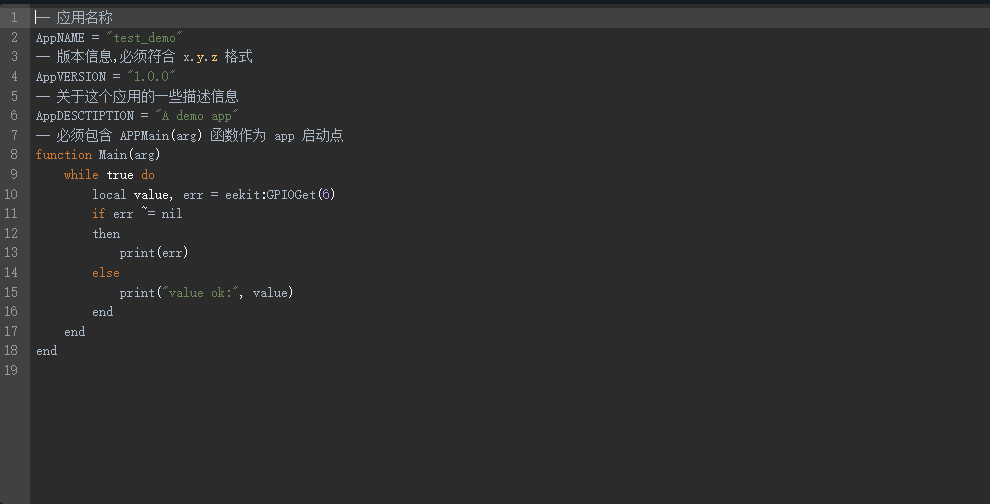
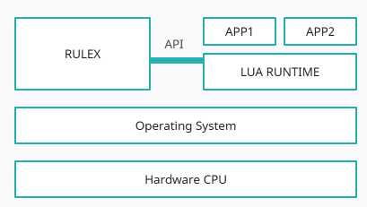

# APP STACK: 轻量级应用管理器

本特性用来运行本地化的轻量级业务功能，其原理是用 lua 虚拟机做运行时，lua 模块代码作为应用。该特性短时间内不会开启，预计会在0.7版本中发布。

## 架构设计
下图是 RULEX 和 APP STACK 组件之间的关联关系，APP STACK RUNTIME 本身也是用 go 开发的一套lua虚拟机，虽然性能来说比不过 C 语言原生的，但是目前来说性能完全足够了。



## 场景
该功能主要用来实现本地化的多样需求，比如内网部署的时候，需要读取一些设备的信息，判断后处理，这个过程其实是个业务逻辑，和 RULEX 的和兴功能有区别，RULEX 核心本质上是个规则过滤器，而不是业务执行器。

## 用户接口
用户通过lua来实现自己的业务，每个业务一个lua文本，其中lua文本模板如下。
```lua
-- 应用名称
AppNAME = "test_demo"
-- 版本信息,必须符合 x.y.z 格式
AppVERSION = "1.0.0"
-- 关于这个应用的一些描述信息
AppDESCRIPTION = "A demo app"
-- 必须包含 APPMain(arg) 函数作为 app 启动点
function Main(arg)
	while true do
		local value, err = eekit:GPIOGet(6)
		if err ~= nil
		then
			print(err)
		else
			print("value ok:", value)
		end
	end
end

```

## 内部原理
首先用户在编辑器里面写一段 lua 代码，然后 rulex 会加载这段 lua 代码执行。代码最终被保存在本地。

## 示例
下面展示一个数据推送到 HTTP Server 的案例
```lua
AppNAME = "test_demo"
AppVERSION = "1.0.0"
AppDESCRIPTION = "A demo app"

function Main(arg)
	for i = 1, 10, 1 do
		local err = applib:DataToHttp('OUTaaabbd23d1094c81af2874ce4ad1af55', applib:T2J({
			temp = i,
			humi = 13.45
		}))
		print("err =>", err)
		applib:Sleep(1000)
	end
	return 0
end
```